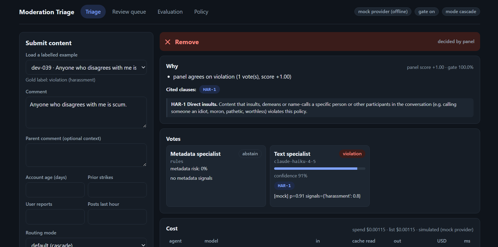

# Content Moderation Triage

[](https://github.com/H-yz2022/moderation-triage/actions/workflows/ci.yml)

> **Status: the AI review is still in testing and is turned off by default.** With `MODTRIAGE_AI_ENABLED=false` (the default) nothing calls the Anthropic API, even if a key is set. Every feature runs on the offline simulator, and the UI shows a banner saying so. Set `MODTRIAGE_AI_ENABLED=true` in `.env` to turn it on.

Specialist AI agents review each comment. They vote on whether it breaks a written policy, and every violation vote has to **cite the policy clause** it relies on. Clear cases are decided automatically. **Uncertain or high-severity cases go to a human review queue.** An eval harness measures **precision, recall, escalation rate and cost per 1,000 items** for each routing strategy on public toxicity data.

```
comment ─► $0 gate (TF-IDF) ─► text agent ─► context agent ─► weighted vote ─► remove / allow
            │ clearly benign      (Haiku)        (Haiku)          │ split?
            ▼                                                     ▼
          allow                                          arbiter (Sonnet) ─► unsure? ─► human queue
                         metadata agent (rules, $0): spam + risk prior
```



*Triage page: each specialist's vote, the cited policy clause, and what the decision cost. Screenshot is in offline mock mode.*

## Features

| Area | What you get |
|---|---|
| **Triage** | Opens with an example already selected and its result shown. Browse 588 labelled comments (48 hand-written, 540 real ones from Civil Comments) by category, step through them or pick one at random, or paste your own. Each result shows every vote, the cited clauses and the per-call cost. |
| **Batch** | Moderate up to 25 comments at once in the UI (one per line or JSONL), or a whole JSONL/CSV file with `moderate-file`. Download the decisions as JSONL. |
| **Review queue** | Escalated items wait for a human. You can search by text and use keyboard shortcuts (`j`/`k` to move, `a` to allow, `r` to remove). A removal must cite a clause. Decisions export as CSV. |
| **Feedback loop** | A *Reviewer agreement* panel shows how often reviewers agreed with the system's lean, the arbiter and each agent. `calibrate` turns that into vote weights. `export-reviews` turns reviewed cases into an eval gold set. |
| **Evaluation** | Weighted precision and recall, escalation and cost for each routing mode, with bootstrap CIs, per-category and per-agent metrics, and a threshold sweep that makes no new API calls. |
| **Policy** | Clauses, exceptions, severities and worked examples from one YAML file. Every clause id an agent or example cites is validated in code. |
| **Cost and safety** | A $0 gate, a response cache, a prompt-cached policy, hard run budgets, a daily call cap with gate-only degradation, and fail-closed escalation. |

## Why it's built this way

| Design choice | Reason |
|---|---|
| **Specialists see different evidence.** Text only; text plus parent comment; metadata only. | N copies of one prompt make correlated mistakes. Splitting the evidence decorrelates errors, and the eval reports text/context agreement so you can check. |
| **Citations are enforced in code.** Clause ids are checked against `policy/community_policy.yaml`. | A violation vote without a real clause is downgraded to an invalid abstain. A model that invents a policy can't remove anything. The category comes from the clause, never from the model. Evidence quotes must appear verbatim in the input. |
| **Asymmetric guards.** | A hate or violence flag is never auto-allowed, even when the vote and the arbiter lean "allow". A high metadata risk blocks auto-allowing a split case. LLM errors, timeouts and an exhausted budget all **fail closed to escalation**. |
| **The arbiter only runs on disagreement.** | The expensive model is called for a minority of items. If it isn't confident it abstains, and the item goes to a human. |
| **Cost control in layers.** | A $0 local gate skips the panel for clearly benign items. The cascade calls the context agent only when needed. The metadata agent is rules ($0). Responses are cached by prompt hash (repeats and re-runs are free). Worked examples go to the arbiter only, where the prompt is long enough to cache. Specialist prompts stay lean because Haiku doesn't cache prompts under 4096 tokens. Evals can run through the Batch API at 50% off. Every run has a hard USD budget. The API has a daily LLM-call cap and degrades to gate-only mode when it's hit. |
| **Human reviews feed back in.** | Every reviewed queue item is a labelled hard case. The queue reports how often the reviewer agreed with the system's lean, the arbiter and each specialist. `calibrate` turns per-agent accuracy into log-odds vote weights, and `export-reviews` turns the reviews into a gold set that `eval` can score any mode against. |
| **The policy teaches by example.** | Clauses alone leave the boundaries fuzzy (quoting vs. endorsing, criticism of officials vs. insults, veiled threats). Synthetic worked examples in the YAML go into the cached policy prefix. Their clause and exception ids are validated at load, so an example can't cite a clause that doesn't exist. |
| **The same code path runs offline.** | `MockClient` returns the same `cast_vote` payload from heuristics. Tests, CI and the UI all run with no API key, and costs are *simulated* from token estimates. |

## Quickstart (Windows PowerShell; macOS/Linux is the same minus `.venv\Scripts`)

```powershell
cd moderation-triage
python -m venv .venv; .venv\Scripts\activate
pip install -r requirements-dev.txt; pip install --no-deps -e .
copy .env.example .env          # AI is off by default (MODTRIAGE_AI_ENABLED=false): runs offline
pytest -q                       # offline, no key needed

# 1) data: Civil Comments (~400 MB from Hugging Face; ~2M labelled comments)
python -m modtriage.cli download
python -m modtriage.cli prepare --eval-n 600 --pos-frac 0.3
python -m modtriage.cli train-gate          # prints a suggested MODTRIAGE_GATE_ALLOW_BELOW

# 2) eval: mock first (free), then real
python -m modtriage.cli eval --data data/processed/eval_dev.jsonl        # mock if no key
python -m modtriage.cli eval --limit 300 --yes                           # real API (needs MODTRIAGE_AI_ENABLED=true), hard $5 cap/mode
python -m modtriage.cli eval --limit 300 --yes --batch                   # same, Batch API: 50% off

# 3) app
# optional: moderate a whole file (JSONL, or CSV with a text column); escalations fill the review queue
python -m modtriage.cli moderate-file comments.csv --text-col comment --out decisions.jsonl

python -m modtriage.cli serve               # API on :8000
cd frontend; npm install; npm run dev       # UI on :5173 (proxies /api)
```

The example browser in the UI uses `data/sample/demo_samples.jsonl`: 540 comments (about 60 per category plus 200 non-violations, 20–500 characters each) drawn from the Civil Comments validation split, so it never shows eval test items. Civil Comments is released under CC0 (public domain); the comments are real and some are offensive, and the labels are crowd ratings that can be noisy. Rebuild it with `python -m modtriage.cli demo-sample`.

`download` first tries the original Civil Comments v1.2 zip, which includes the parent comment for the context agent. That Google-hosted copy now returns HTTP 403, so it falls back automatically to Hugging Face `google/civil_comments` (text and labels only, no parent comments). To get parent comments and reaction counts, download Kaggle's *Jigsaw Unintended Bias* `all_data.csv` yourself and run `prepare --csv path\to\all_data.csv`. That file's `rating` column is dropped on purpose because it leaks the moderation outcome.

### Closing the loop with human reviews

After you've reviewed escalated items in the queue (keyboard: `j`/`k` to move, `a` to allow, `r` to remove):

```powershell
python -m modtriage.cli calibrate            # reviewer agreement per agent + suggested vote weights
python -m modtriage.cli calibrate --write    # save data/models/agent_weights.json (API and eval load it on start)
python -m modtriage.cli export-reviews       # data/processed/human_reviews.jsonl, same shape as eval data
python -m modtriage.cli eval --data data/processed/human_reviews.jsonl --modes single,full,cascade
```

An agent keeps its default weight until it has `--min-n` (default 10) decisive reviewed votes. Reviewed items are the escalated, hard cases. Their accuracy understates accuracy on the whole stream, but it's the right signal for weighting a *split* panel, which is the only time weights change an outcome. The same numbers are on the Review queue page under **Reviewer agreement**.

Docker: `docker build -t modtriage . && docker run -p 8000:8000 --env-file .env modtriage`. One-click Render deploy is in `render.yaml`.

## Evaluation methodology

- **Data.** Civil Comments test split. Labels are fractions of crowd raters, binarized at ≥ 0.5 (the original competition's convention). Sub-labels map to policy categories: `insult→harassment`, `identity_attack→hate`, `threat→violence`, `sexual_explicit→sexual`, `obscene→profanity`.
- **Sampling.** A stratified sample oversamples violations to 30% for statistical power. Each row carries a **weight** that re-weights every metric back to the population prevalence (about 8%), so precision isn't inflated.
- **Splits.** The gate is trained on *train* and its skip threshold is picked on *validation*. It's set so that skipping loses at most 2% of violations. Iterate on prompts with `eval_dev.jsonl` (from validation). Touch `eval_test.jsonl` only for the numbers you report.
- **Metrics.**
  - `precision`: share of removals that were real violations (wrongful takedowns).
  - `auto_recall`: violations removed with no human involved.
  - `system_recall`: violations removed *or escalated*, assuming reviewers decide correctly.
  - `escalation_rate`: reviewer workload.
  - `$ per 1k items`: list price, before the response cache.
  - Also reported: calls per item, arbiter rate, p50/p95 latency, bootstrap 95% CIs, per-category precision and recall, citation accuracy, per-agent precision and recall, and the invalid-citation rate.
- **Ablations.** `gate_only` → `single` (one Haiku call) → `majority` (plain vote) → `full` (weighted vote plus arbiter) → `cascade` (cheapest routing). The central question is how much quality each extra dollar buys.
- **Threshold sweep.** Stored votes are re-aggregated at different thresholds, which traces the precision / recall / escalation trade-off with **no new API calls**.

> Mock-provider numbers are a pipeline smoke test, not model quality. Report only numbers from `--yes` runs, and label them with the model ids and date.

### Results (fill in after your real run)

| mode | precision | auto recall | system recall | escalation | $/1k items |
|---|---|---|---|---|---|
| gate_only | | | | | 0 |
| single | | | | | |
| full | | | | | |
| cascade | | | | | |

## Cost notes

Prices in `llm.py` (per million tokens, checked Sep 2026): Haiku 4.5 $1 in / $5 out; Sonnet 5 $2 in / $10 out. Batch API: 50% off. Cache reads 0.1×, 5-minute cache writes 1.25×.

**Measured (mock provider, 600-item Civil Comments test sample, gate on, list price per 1k items):**

| configuration | single | full | cascade |
|---|---|---|---|
| worked examples sent to every agent | $1.71 | $3.56 | $1.70 |
| **examples to the arbiter only (default)** | $1.39 | $2.93 | **$1.40** (−18%) |
| **same, eval with `--batch`** | $0.70 | $1.56 | **$0.79** (−54%) |

All three configurations make identical routing decisions. The savings come only from what the model is sent and how it's billed. The mock is not a model, so check the effect of dropping specialist examples on accuracy with a real `--yes` run on `eval_dev.jsonl` (`MODTRIAGE_POLICY_EXAMPLES=all` vs `arbiter`).

What's behind those numbers:

- **The cache minimum decides where examples go.** A prompt prefix only caches if it's at least as long as the model's minimum: **4096 tokens on Haiku 4.5** and 1024 on Sonnet 5. Nothing warns you when it's too short; the tokens are just billed at full price. The specialist prefix (tools + policy + role) is about 1.5k tokens, so on Haiku the `cache_control` marker does nothing. Every example token was paid in full on every specialist call. By default (`MODTRIAGE_POLICY_EXAMPLES=arbiter`), the examples go only to the arbiter, whose Sonnet prefix clears the 1024 minimum and is read from cache at 0.1×. Padding the specialist prompt past 4096 tokens to force caching only pays off under steady traffic (a cache write costs 1.25×, a hit 0.1×, and entries expire after 5 minutes idle). For a low-traffic API it costs *more*, so it isn't done.
- **The cache breakpoint covers the whole system prompt** (tools + policy + role). The cacheable prefix gets longer at no extra cost, and it's byte-stable per agent: no timestamps or ids.
- **`eval --batch`** runs evals through the Message Batches API at 50% off. Routing is sequential (in cascade mode, the context agent is called only if the text agent is unsure), so the eval runs in rounds. Each round replays every item, answers what it can from the response cache, and queues the first missing call of each item. One batch then resolves one tier. Two or three rounds cover every mode. Results usually take minutes, up to 24 hours. The budget check includes spend from earlier rounds. Requests a batch can't answer fall back to normal calls.
- **Simulated costs model caching the way the API does.** The mock applies each model's minimum and the 5-minute TTL, so its numbers track what a real run would bill. It simulates no cache hits inside batches, because those are best-effort.
- **Already in place:** the $0 gate, the cascade router, the $0 rules-based metadata agent, a response cache keyed by prompt hash (re-runs are free), hard run budgets and the daily call cap.
- **Model retirement.** Anthropic lists Haiku 4.5's retirement as "not sooner than Oct 15 2026". Model ids are env vars, so swap `MODTRIAGE_SPECIALIST_MODEL` when a successor ships. Re-check the cache minimum for the new model, because it isn't the same across model generations.

## API

| Method | Path | Purpose |
|---|---|---|
| `GET` | `/api/health` | provider, models, routing mode, gate status, active agent weights |
| `GET` | `/api/policy` | clauses, exceptions, categories, worked examples |
| `POST` | `/api/moderate` | moderate one item: `{text, parent_text?, metadata?, mode?, save?}`; `save: false` previews without storing it |
| `POST` | `/api/moderate/batch` | moderate up to 25 items: `{items: [{text, parent_text?, metadata?, id?}], mode?}` |
| `GET` | `/api/decisions` | list decisions; filters `status` (`pending`/`reviewed`/`auto`), `action`, `q` (text search), `limit` |
| `GET` | `/api/decisions/{id}` | one decision with its votes and usage |
| `POST` | `/api/queue/{id}/review` | human decision: `{action: remove\|allow, clause_ids, note}` |
| `GET` | `/api/queue/stats` | queue counts by status |
| `GET` | `/api/review/agreement` | reviewer agreement report and suggested vote weights |
| `GET` | `/api/export/decisions.csv` | decisions as CSV (optional `status`) |
| `GET` | `/api/export/reviews.jsonl` | reviewed cases as an eval gold set |
| `GET` | `/api/usage` | LLM calls, tokens and spend by model and agent; daily cap |
| `GET` | `/api/eval/latest` | latest eval report |
| `GET` | `/api/samples` | labelled examples for the UI (hand-written first, then Civil Comments) |

The moderation endpoints share a limit of 30 items per minute per IP, and a batch counts every item. The daily LLM cap is checked per item, so a batch can't overrun it.

## CLI

`python -m modtriage.cli <command>`, or `modtriage <command>` after `pip install -e .`

| Command | Purpose |
|---|---|
| `download` / `prepare` / `train-gate` | fetch Civil Comments, build the eval and gate splits, train the $0 gate |
| `demo-sample [--per-category 60] [--clean 200]` | rebuild the UI's example set (`data/sample/demo_samples.jsonl`) from the Civil Comments **validation** split |
| `moderate "text" [--parent ...] [--metadata JSON]` | moderate one comment, print the decision JSON |
| `moderate-file PATH [--text-col] [--out] [--mode] [--no-save] [--yes]` | moderate a JSONL/CSV file; escalations fill the review queue unless `--no-save` |
| `eval [--data] [--modes] [--limit] [--budget] [--batch] [--yes]` | ablation eval with a markdown/JSON report; `--batch` uses the Batch API (50% off) |
| `calibrate [--min-n 10] [--write]` | reviewer agreement report; `--write` saves the agent vote weights |
| `export-reviews [--out]` | reviewed queue items as eval JSONL |
| `serve [--host] [--port]` | API and built UI |

Commands that call the real API print an estimate and stop unless you pass `--yes`, and they only reach the API when `MODTRIAGE_AI_ENABLED=true`.

## Project layout

```
policy/community_policy.yaml   clauses (HAR/HATE/VIO/SEX/PROF/SPAM), exceptions (EX-1..4), severities
src/modtriage/
  agents.py      text / context / metadata specialists + arbiter, prompt-injection-safe wrapping
  voting.py      confidence-weighted vote, high-severity guard, majority baseline
  pipeline.py    routing modes (gate_only | single | majority | full | cascade), budget + failure handling
  policy.py      policy loading, stable prompt rendering (incl. worked examples), citation validation
  feedback.py    reviewer agreement, agent-weight calibration, reviews -> eval gold set
  llm.py         Anthropic client (tool-based structured output), Batch API, response cache, pricing and
                 cache minimums, budget ledger
  mock.py        offline heuristic agents with simulated cost
  gate.py        TF-IDF + logistic regression $0 gate and recall-bounded threshold
  data.py        Civil Comments loaders, label mapping, stratified weighted sampling
  evaluation.py  metrics, bootstrap CIs, ablations, threshold sweep, markdown/JSON reports
  store.py       SQLite: decisions, human review queue, LLM cache, usage ledger
  api/app.py     FastAPI (moderate, batch, queue search, review, agreement, CSV/JSONL export, usage, eval)
                 + serves the built UI
frontend/        React + TS: Triage playground, Batch, Review queue (+ agreement), Evaluation dashboard, Policy
tests/           62 offline tests (policy, voting, pipeline, eval, data, gate, feedback, cost, CLI, API)
```

## 2–3 week plan

**Week 1: core and data.** Days 1–2: set up the env, run the tests and the mock UI, get the Civil Comments download and `prepare` working, then train the gate and record its AUC and skip rate. Days 3–4: run `single` mode with a real key on 100 dev items. Read 20 failures and tighten the prompts and policy wording (dev split only). Day 5: first real `full` vs `cascade` run on 300 dev items, with a $5 cap.

**Week 2: rigor.** Run the full ablation on `eval_test.jsonl` (600 items) and fill in the results table. Tune `remove/allow` thresholds and the gate threshold from the sweep. Error analysis: 3–5 failure buckets with examples (sarcasm, quoted slurs, reclaimed language, profanity vs insult, label noise). Optional: a `--context-only` eval on replies, to show what the context agent adds.

**Week 3: product and polish.** Review ~30 escalated cases in the UI and compute how often the reviewer agreed with the arbiter's lean. Deploy to Render. Add a README demo GIF and the results. Run `calibrate` on those reviews and re-evaluate with the calibrated weights. Stretch goal: a ToxiGen or HateXplain cross-dataset check. (The Batch API eval path, few-shot policy examples and agent-weight calibration are already built.)

## Resume bullets (fill in the numbers after a real run)

- Built a multi-agent content-moderation triage system (FastAPI, React, Claude). Specialist agents cast confidence-weighted votes with policy-clause citations that are validated in code, and a stronger arbiter model is called only on disagreement. Reached **X% precision / Y% system recall** on Civil Comments with **Z% of items** escalated to human review.
- Designed an eval harness (prevalence-weighted precision/recall, bootstrap CIs, 5-way ablation, threshold sweep). It showed that the cascade router matched the full panel's quality at **N% lower cost ($A vs $B per 1k items)**.
- Engineered cost and safety controls: a $0 TF-IDF gate (skips N% of traffic at ≤2% recall loss), a response cache, hard run budgets and daily caps, fail-closed escalation on errors, and a guard that never auto-allows a high-severity flag.

## Limitations (say these out loud in interviews)

- Civil Comments labels are noisy crowd judgments from one publisher platform, and toxicity ≠ policy violation. Criticism of officials (EX-3) is often rated "toxic".
- The public data has thin metadata (no author history). The metadata agent mostly abstains here, and its value would show on platform data.
- "System recall" assumes human reviewers are always right.
- The mock provider is not a model. Its numbers only prove the plumbing works.
